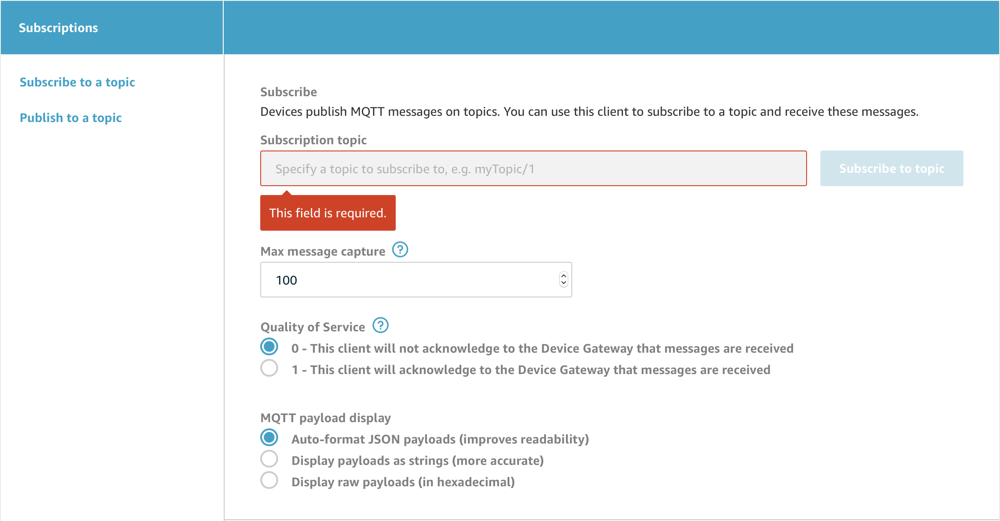

# GSM IoT Button
IoT project demonstrating Moduino X1 running Mongoose OS that publishes a MQTT message to AWS IoT when the Mode button is pressed over a GSM connection.

## Common Prerequisites
Ensure you have:
- [Moduino X1](https://moduino.techbase.eu)
- [mos](https://github.com/cesanta/mos-tool)
- [esptool](https://github.com/espressif/esptool)
- [AWS CLI](https://docs.aws.amazon.com/cli/latest/userguide/cli-chap-install.html) installed and [configured](https://docs.aws.amazon.com/cli/latest/userguide/cli-chap-configure.html) 
- Relevant USB to Serial driver installed
- APN settings for your carrier which can be commonly found on the t'internet

## Windows Prerequisites
- Ensure directory that contains mos.exe is added to your PATH system variable
- [Chocolatey](https://chocolatey.org/install) is installed
- [GNU Make](https://chocolatey.org/packages/make) is installed

## Configuring APN
In `mos.yml`:
- Replace your-carrier-apn with your carrier's APN
- Replace your-carrier-username with your carrier's username
- Replace your-carrier-password with your carrier's password

## Building Project
Build project by using either command:

```
mos build --platform esp32 --clean
```

or

```
make
```

## Flashing Moduino
To flash Moduino X1:
1. Power down Moduino
2. Connect BOOT pin to GND
3. Power up Moduino
4. Run command:


**Mac/Linux Users**
```
make flash
```

**Windows Users**

Navigate to `build` directory and extract `fw.zip` into `extract` directory within `build`. Then run command
```
$ make wipe
$ make flash_device_win

```
5. When terminal outputs message below power down and power up moduino
```
Connecting...
```
6. Disconnect BOOT pin from GND and cycle power to moduino

## Console
To display logs from Moduino, run command
```
make console
```

## Device Setup
Ensure you the device has connected to the GSM network and has internet connection. Run command to provision moduino on AWS IoT
```
mos aws-iot-setup
```
provision to specific region

```
mos aws-iot-setup --aws-region <desired region>
```
`Note`: mos tool does not support multiple aws profiles so ensure the AWS account you want to provision it on is your default profile.

If this is successful moduino will show up in AWS Console under AWS IoT -> Manage -> Things. Alternatively you can AWS CLI to list your provisioned device:

```
aws iot list-things
```

## Test MQTT
Find your Moduino's device ID and copy it

```
mos config-get device.id
```

In AWS Console (ensure you're in the region that the moduino was provisioned to) go to AWS IoT -> Test. 



Subscribe to topic `<copied device ID>/button_pressed` leaving other options to default settings.

Press the Mode button on the Moduino X1 and message should pop up on the AWS MQTT client
```
{
    "modeBtn": "Button pressed"
}
```
The following message should also appear in the device console logs

```
Published: yes topic: <your device ID>/button_pressed message: {\"modeBtn\":\"Button pressed\"}
```
